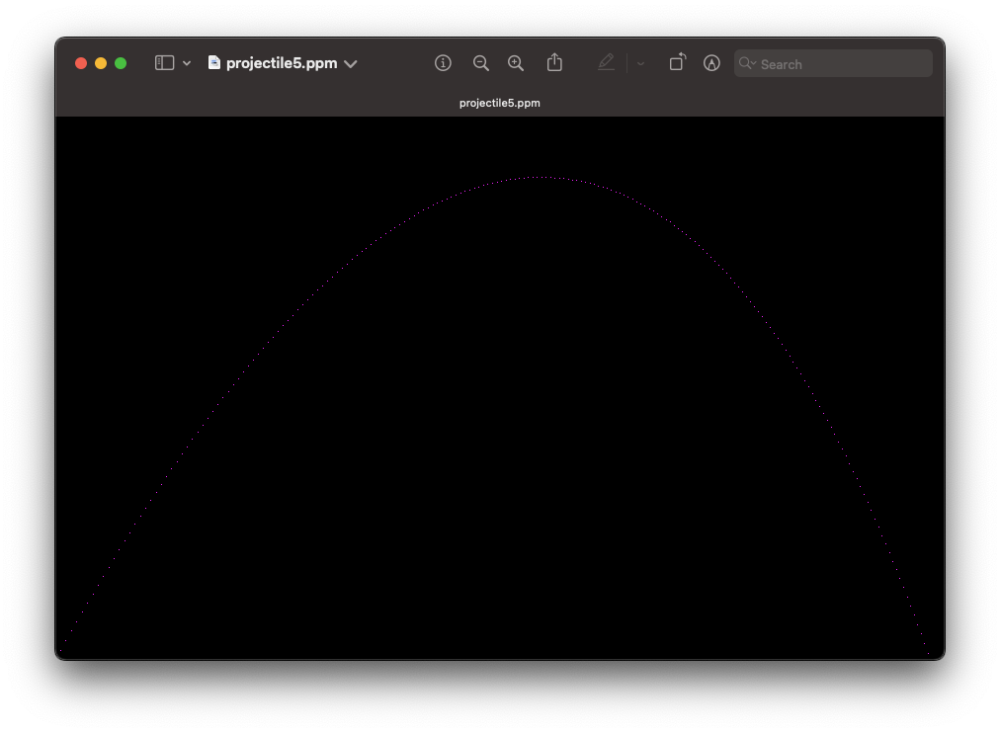

# RayTracer

<p align="center">
    
</p>

This repository contains the source code for my attempt at building a **ray tracer** while following [The Ray Tracer Challenge](http://raytracerchallenge.com/).

The challenge allows the ray tracer to be implemented on any programming language and environment, so I chose Swift. 

The current goal is to be able to render the following images:

<table>
    <tr>
        <td>
            
            <p align="center">Transformed surfaces</p>
        </td>
        <td>
            
            <p align="center">Reflection, Refraction, and Shadows</p>
        </td>
    </tr>
    <tr>
        <td>
            
            <p align="center">Objects composed of polygons</p>
        </td>
        <td>
            
            <p align="center">Constructive Solid Geometry (CSG)</p>
        </td>
    </tr>
</table>

## Current progress

### Chapter 1. Tuples, Points, and Vectors.
Chapter 1 is complete with implementation of primitives (tuples, points, and vectors) and some of its operations (add, subtract, scalar multiplication and division, dot product, cross product, normalization, and magnitude). 

To test these in action, a sample CLI tool named `projectiles` can be run to play a simulation of firing virtual projectiles and see how far they go. To run you can set up a terminal and type the following command. 

The CLI tool reads a JSON file that requires a `position`, a `velocity`, a `gravity` and `wind`. You can also pass an optional `maximum-fraction-digits` that will control the amount of fraction digits displayed in calculations. If not passed, *it will default to show **4 fractional digits***. An example for this file is included [here](Examples/Files/projectiles.json).

Usage:
```bash
# Passing an input JSON file with values
swift run projectiles --input Examples/Files/projectiles.json

# Passing name of subcommand
swift run projectiles calculate --input Examples/Files/projectiles.json

# Passing custom fractional digits
swift run projectiles calculate --input Examples/Files/projectiles.json --maximum-fraction-digits 6
```

### Chapter 2. Drawing on a Canvas

Chapter 2 is complete with image generation in PPM format.

To test it in action, the `projectiles` sample CLI tool has a `graph` subcommand that generates a PPM image file with custom output file and canvas size. 

*An example input file is included [here](Examples/Files/graph.json) which generates the following image:*



Usage:

```bash
# Run with custom output file
swift run projectiles graph --input Examples/Files/graph.json --output ~/Downloads/projectile5.ppm --width 900 --height 550

# Running without custom file will generate a `projectile.ppm` image in the current directory
swift run projectiles graph --input Examples/Files/graph.json --width 900 --height 550
```