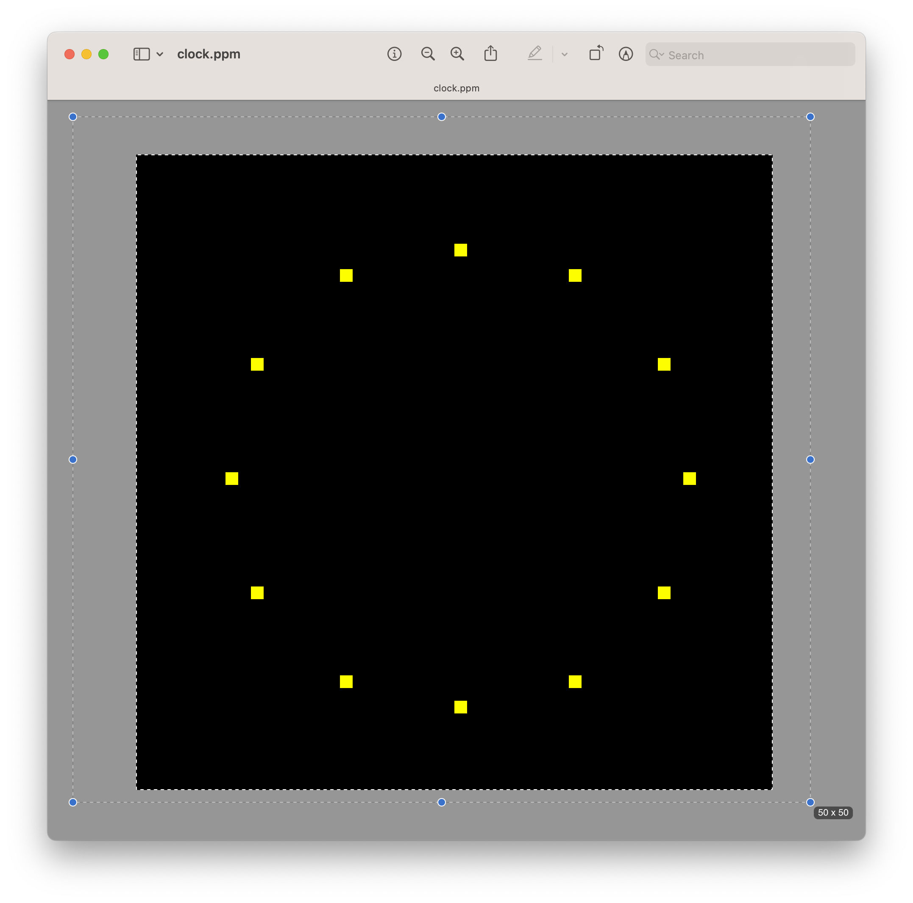

# RayTracer

<p align="center">
    
</p>

This repository contains the source code for my attempt at building a **ray tracer** while following [The Ray Tracer Challenge](http://raytracerchallenge.com/).

The challenge allows the ray tracer to be implemented on any programming language and environment, so I chose Swift. 

The current goal is to be able to render the following images:

<table>
    <tr>
        <td>
            
            <p align="center">Transformed surfaces</p>
        </td>
        <td>
            
            <p align="center">Reflection, Refraction, and Shadows</p>
        </td>
    </tr>
    <tr>
        <td>
            
            <p align="center">Objects composed of polygons</p>
        </td>
        <td>
            
            <p align="center">Constructive Solid Geometry (CSG)</p>
        </td>
    </tr>
</table>

## Current progress

### Chapter 1. Tuples, Points, and Vectors.
Chapter 1 is complete with implementation of primitives (tuples, points, and vectors) and some of its operations (add, subtract, scalar multiplication and division, dot product, cross product, normalization, and magnitude). 

To test these in action, a sample CLI tool named `projectiles` can be run to play a simulation of firing virtual projectiles and see how far they go. To run you can set up a terminal and type the following command. 

The CLI tool reads a JSON file that requires a `position`, a `velocity`, a `gravity` and `wind`. You can also pass an optional `maximum-fraction-digits` that will control the amount of fraction digits displayed in calculations. If not passed, *it will default to show **4 fractional digits***. An example for this file is included [here](Examples/Files/projectiles.json).

Usage:
```bash
# Passing an input JSON file with values
swift run projectiles --input Examples/Files/projectiles.json

# Passing name of subcommand
swift run projectiles calculate --input Examples/Files/projectiles.json

# Passing custom fractional digits
swift run projectiles calculate --input Examples/Files/projectiles.json --maximum-fraction-digits 6
```

### Chapter 2. Drawing on a Canvas

Chapter 2 is complete with image generation in PPM format.

To test it in action, the `projectiles` sample CLI tool has a `graph` subcommand that generates a PPM image file with custom output file and canvas size. 

*An example input file is included [here](Examples/Files/graph.json) which generates the following image:*


Usage:

```bash
# Run with custom output file
swift run projectiles graph --input Examples/Files/graph.json --output ~/Downloads/projectile5.ppm --width 900 --height 550

# Running without custom file will generate a `projectile.ppm` image in the current directory
swift run projectiles graph --input Examples/Files/graph.json --width 900 --height 550
```

### Chapter 3. Matrices.

Chapter 3 is complete with implementation of matrix primitives (2x2 matrix, 3x3 matrix, and 4x4 matrix) and some of their operations: multiplication of 4x4 matrices, multiplication of 4x4 matrix and tuple, matrix transposition, matrix inversion, obtaining determinants, obtaining submatrices, obtaining minors, and computing cofactors.    

At the end of the chapter there are some experiments to try, these questions are answered with a simple CLI program that can be run with the following command:

```bash
swift run matrix-experiments 
```

### Chapter 4. Matrices.

Chapter 3 is complete with implementation of matrix transformations (translation, scaling, rotation, and shearing). This operations can also be chained. Normally, chained operations need to be written in reverse order to perform the desired calculation - this is counterintuitive so, in order to have better readability, a composition operator `>>>` is introduced to allow chaining transformation matrices while writing them in natural order.

For example, to chain translation, rotation in X and scaling there are now two ways of doing:

```swift
// In reverse order using * 
let normalTransform = scaling(x: 5, y: 1, z: 1) * rotationX(radians: .pi / 2) * translation(x: 1, y: 1, z: 1)

// More intuitive using >>>
let transform = translation(x: 1, y: 1, z: 1) >>> rotationX(radians: .pi / 2) >>> scaling(x: 5, y: 1, z: 1)

print(normalTransform * point(x: 1, y: 1, z: 1))
print(transform * point(x: 1, y: 1, z: 1))
```

To test these operations, a simple CLI tool to generate a "clock" by rotating and scaling a point was created. It generates a PPM file using the canvas from chapter 2. The radius for rotation is 3/8 the size of the specified canvas. You can run it like this:

```bash
swift run matrix-transformations --canvas-size 50 --output ~/Downloads/clock2.ppm
```

*The previous command generates the following image*:


