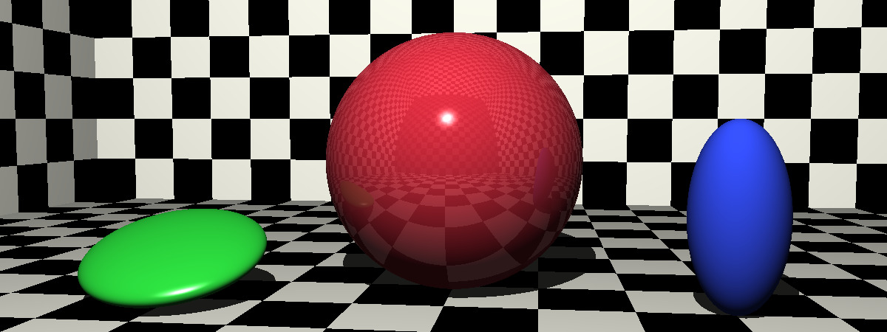
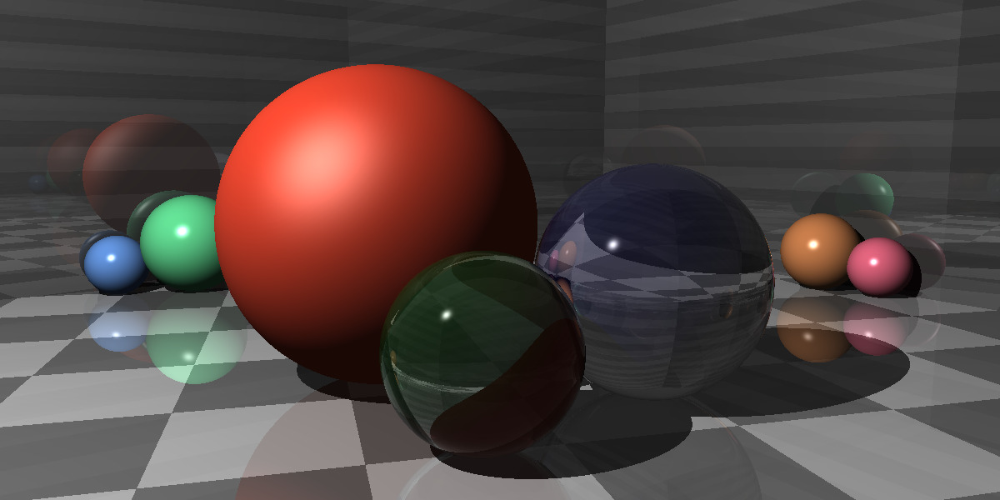
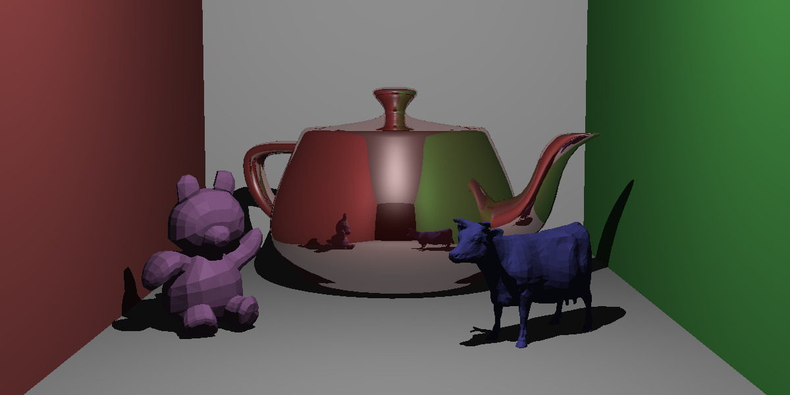
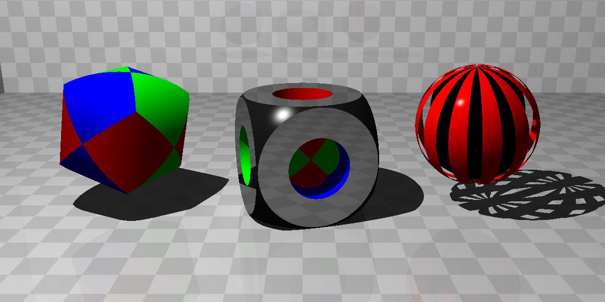

# RayTracer


This repository contains the source code for my attempt at building a **ray tracer** while following [The Ray Tracer Challenge](http://raytracerchallenge.com/).

The challenge allows the ray tracer to be implemented on any programming language and environment so I chose Swift. 

The current goal is to be able to render the following images:

<table>
  <tr align="center">
    <td>
      
      <p>Transformed surfaces</p>
    </td>
  </tr>
  <tr align="center">
    <td>
      
      <p>Reflection, Refraction, and Shadows</p>
    </td>
  </tr>
  <tr align="center">
    <td>
      
      <p>Objects composed of polygons</p>
    </td>
  </tr>
  <tr align="center">
    <td>
      
      <p>Constructive Solid Geometry (CSG)</p>
    </td>
  </tr>
</table>

## Current progress

### Chapter 1. Tuples, Points, and Vectors.
Chapter 1 is complete with implementation of primitives (tuples, points, and vectors) and some of its operations (add, subtract, scalar multiplication and division, dot product, cross product, normalization, and magnitude). 

To test these in action, a sample CLI tool can be run to play a simulation of firing virtual projectiles and see how far they go. To run you can set up a terminal and type the following command. 

```bash
# Using short names for options
swift run projectiles -p '(0,1)' -v '(1,1)' -g '(0,-0.1)' -w '(-0.01,0)'

# Using long names
swift run projectiles --position '(0,1)' --velocity '(1,1)' --gravity '(0,-0.1)' --wind '(-0.01,0)'

# Show help information (-h / --help)
swift run projectiles -h

# Showing an specific amount of maximum fraction digits (by default this parameter is 4)
swift run projectiles -p '(0,1)' -v '(1,1)' -g '(0,-0.1)' -w '(-0.01,0)' --maximum-fraction-digits 6
```